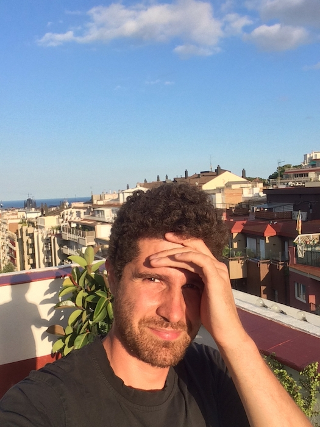

# Hello, my name is Max.

My name is Max Bautista Perpinyà and I am a PhD researcher in the history of science, based in UCLouvain, in Belgium. *Welcome my website*.

On these pages, you'll find a sort of open CV. The basic structure is this:

- my [bio](bio.html).
- the [projects](projects.html) I am working on.
- a [list](pubs.html) of the academic publications and journalistic pieces I've written, the talks I've given, and events I hosted.
- my actual <a href="https://oliviodare.github.io/cv/" target="_blank">CV</a>.

## Socials and getting in touch
My online handle is usually oliviodare.  
This is my <a href="https://twitter.com/oliviodare" target="_blank">twitter</a>.  
This is my <a href="https://www.linkedin.com/in/max-bp/" target="_blank">linkedin</a>.  
This is my <a href="https://orcid.org/0000-0002-5202-6961" target="_blank">ORCID</a> (0000-0002-5202-6961).  
This is my <a href="https://github.com/oliviodare" target="_blank">Github profile</a>.  
This is the <a href="https://pencelab.be/" target="_blank">lab</a> where I'm currently working.   
My email is maximilia ·dot· bautista ·at· uclouvain ·dot· be.

 
Hello!

