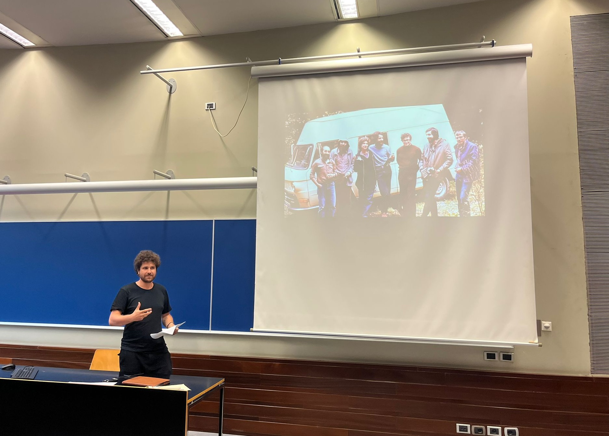
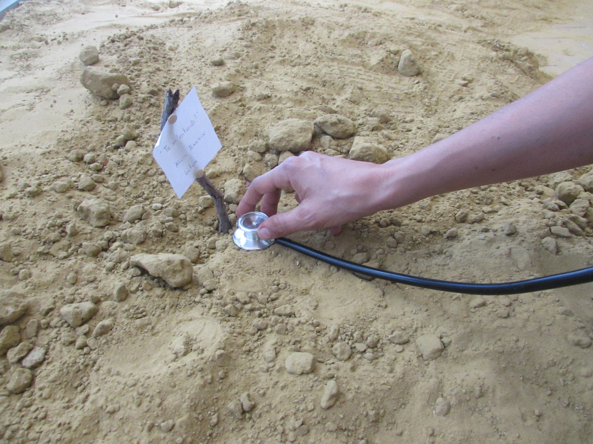
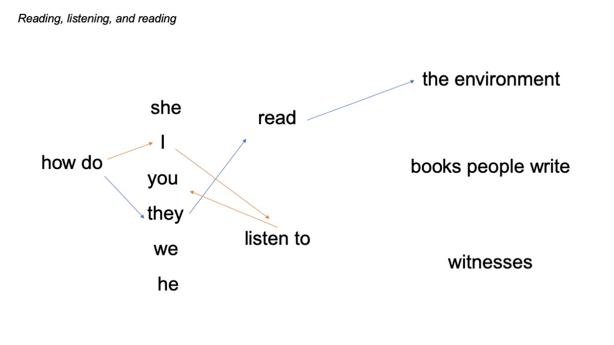
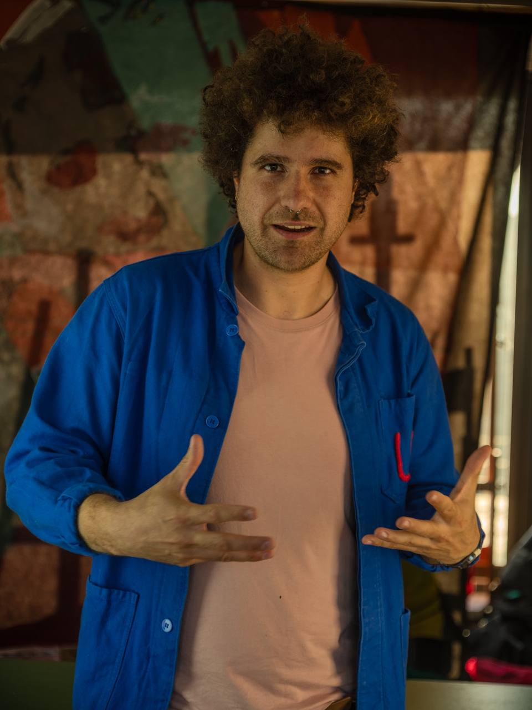

### Jump to:

 |  |
:---|:---|
[Academic works](#academic-works) | 
&nbsp; &nbsp; [Book reviews](#book-reviews) | 
[Oral communications](#oral-communications) |
[Outreach](#outreach) |

## Academic works
*[back to the top](#top)*

Devine S, **Bautista Perpinyà M**, Delrue V, Gaillard S, Jorna T, van der Meer M, Millet L, Pozzebon C, Visser J. ‘Science Fails. Let’s Publish.’ *Journal of Trial and Error*. <a class="dont-break-out" href="https://doi.org/10.36850/ed1" target="_blank">https://doi.org/10.36850/ed1</a>.

Burgos DF, Cussó L, Sánchez-Elexpuru G, Calle D, **Bautista Perpinyà M**, Desco M, Serratosa JM, Sánchez MP. ‘Structural and Functional Brain Abnormalities in Mouse Models of Lafora Disease.’ *International Journal of Molecular Sciences*. 2020; 21(20):7771. <a class="dont-break-out" href="https://doi.org/10.3390/ijms21207771" target="_blank">https://doi.org/10.3390/ijms21207771</a>.

### Book reviews
*[back to the top](#top)*

Bautista Perpinyà, M. & Pence, C. H. (2023): ‘David Sepkoski’s *Catastrophic Thinking*’, *BJPS Review of Books*. <a class="dont-break-out" href="https://www.thebsps.org/reviewofbooks/perpinya-pence-on-sepkoski/" target="_blank">https://www.thebsps.org/reviewofbooks/perpinya-pence-on-sepkoski/</a>.

## Oral communications
*[back to the top](#top)*

### 2025
Speaker, 7th Biennial Conference of the European Rural History Organisation (EURHO), Coimbra (Portugal), September 2025
- "From Genetic Improvement to Biodiversity Conservation: Seed Orchards and Environmental Challenges in Spain in the Dismantling of the Forest Engineering Regime (1966-1999)."

Speaker, International Society for the History, Philosophy, and Social Studies of Biology (ISHPSSB), Porto (Portugal), July 2025
- "Semi-fictitious biographies to think about values in science. An attempt towards performance." 

### 2024
*reading, listening, and reading*. A collective walk on how we read and listen to the environment, history, and each other.

'Reading, listening, and reading' is an interactive installation in the form of a collective walk around sound devices. Conference participants hear the voices of fellow colleagues in environmental history (and neighbouring fields) speaking of their **intimate practices of reading and listening**. We will hear how they read a source, read a colleague's book, actively listen to a witness, or read changes and conflicts in the landscape. The collection of voices is embedded in a mixed-media dispositif: voices, texts, images, and diagrams will serve to create a warm and sensorial space. The guiding thread is to explore how what we read in our environment is **mediated by** the variety of reading practices themselves. This installation is a proof of concept on how artistic practices can serve as methodologies in the ambition to re-think how we share our research beyond conventional academic formats.

This installation has been developed by Brussels-based duo: <a class="dont-break-out" href="https://quand-ils-parlent.jimdofree.com/" target="_blank">Alicia Jeannin</a> (spoken-word audiovisual artist, performer and scenographer) and Max Bautista Perpinyà.

{: style="float: left; width: 300px; margin: 2px; margin-right: 20px" }
Our installation was first presented at the 4th World Congress of Environmental History in Oulu (Finland), 19-23 August 2024 <a class="dont-break-out" href="https://wceh2024.com/" target="_blank">https://wceh2024.com/</a>. It was awarded the European Union's Culture Moves Europe mobility grant.

### 2023
**Speaker, 9th PhD Conference in History of Science and Humanities**, Soeterbeeck Abbey, April 20-21.  
- “Scientific forestry in post-Franco Spain: making 'better' trees at a national network of experimental stations.”

### 2022
**Speaker, 10th conference of the European Society for the History of Science**, Brussels, September 7-10.
- “'Straight trunks' and 'original biocenosis': production and conservation aims of Spanish foresters during the last third of the twentieth century at the Instituto Nacional para la Conservación de la Naturaleza.”
- Session - “Sustainability and Biodiversity.”

**Speaker, III Congreso de la Red Española de Historia Ambiental de España**, Granada, May 11-13.
- “Descentralizando la historia de la biodiversidad: el conocimiento científico y su co-construcción con políticas nacionales ambientales en el ICONA.”
- Session - “Movimientos sociales-ambientales. Nuevas propuestas.”

### 2021
**Speaker, British Society for the History of Science**, Online, July 13.
- “‘If You Need a New Microscope – Why Purchase an Old One?’ Scientific Advertisements in Nature and Their Role in the Printed Forum of the Laboratory Research Community.”
- Lightning Session – “Patrons, Publics, and Profiteers: Selling Science in the Nineteenth and Twentieth Centuries.” <a class="dont-break-out" href="https://youtu.be/0Bhw1H8JuJU" target="_blank">https://youtu.be/0Bhw1H8JuJU</a>.

**Invited speaker, Sociedad Española de Bioquímica y Biología Molecular,** Online, February 2.
- “¿Qué es una publicación científica? Reflexiones históricas, filosóficas, y críticas.”   
- Roundtable – “¿Qué es una publicación científica? Cómo generar una publicación científica. Tipos de publicaciones. Publicar en abierto: Open Science. Publicar resultados negativos.” <a class="dont-break-out" href="https://youtu.be/BsdnXtBwKAc?t=4129" target="_blank">https://youtu.be/BsdnXtBwKAc?t=4129</a>.

### 2020
**Speaker, Descartes Centre for the History and Philosophy of the Sciences and the Humanities,** Utrecht, October 29.
- “To be a molecular scientist: Technical social responsibility in 1970s _Nature_ advertisements and leaders.”  

**Invited speaker, Universidad Técnica de Manabí, IV Conveción Científica Internacional,** Online, October 20.
- “Ciencia Abierta: Globalidad y Localidad.”   
- Roundtable “Sistemas latinoamericanos de indexación: ética o estética.”   

**Panellist, Open Publishing Fest,** Online, May 25.
- “Presenting the Journal of Trial and Error.”  

**Invited speaker and panellist, University of Bern, Early-Career Swiss Society for Neuroscience**, Bern, February 21.
- “The Journal of Trial and Error meets the Early-Career Swiss Society for Neuroscience.”  

**Invited speaker, Erasmus University Rotterdam, Open Science Community RproducibiliTea meeting,** Rotterdam, February 12.
- “ReproducibiliTea: Meet the Journal of Trial and Error.”  

### 2019    
**Invited speaker, Cambridge University, Laboratory of Molecular Biology,** Cambridge, July 19.
- “The Journal of Trial and Error. Publishing science in the making: trying and erring in the age of open science”.   
- Annual Graduate Student Symposium.

## Outreach
*[back to the top](#top)*

Blogpost (2021). “<a class="dont-break-out" href="http://eseh.org/online-conferences-wont-do-it-instead-of-sustainable-academic-history-we-need-engaged-historians-working-less-and-collaborating-with-activists/" target="_blank">Online conferences won’t do it. Instead of ‘sustainable’ academic history, we need engaged historians working less and collaborating with activists</a>”, Sustainable Academia seires, _Next Generation Action Team (NEXTGATe), European Society for Environmental History_ and _Historians for Future_.  

Interview (2020). “<a class="dont-break-out" href="https://blog.trialanderror.org/jote-in-conversation-with-researchers-daniel-lakens-whose-fault-is-it-that-science-is-irreproducible-and-who-the-heck-are-metascientists" target="_blank">JOTE in conversation with researchers: Daniël Lakens. Whose fault is it that science is irreproducible? And who the heck are metascientists?</a>” _Journal of Trial and Error_.  

Blogpost (2020). “<a class="dont-break-out" href="https://openscience-utrecht.com/open-science-symposium-starting-off-with-the-natural-sciences/" target="_blank">Open Science Symposium – Starting off with the Natural Sciences.</a>” _Blog: the Road to Open Science_, Open Science Community Utrecht.  

Editorial, with Martijn van der Meer (2019). “<a class="dont-break-out" href="https://blog.trialanderror.org/are-we-facing-a-bigger-monster-the-journal-of-trial-and-error-visits-cambridge" target="_blank">Are we facing a bigger monster? The Journal of Trial and Error visits Cambridge.</a>” _Journal of Trial and Error_.  

Blogpost (2020). “Holanda Abierta.” Post in blog of association ‘Científicos Españoles en los Países Bajos/Spanish Scientists in the Netherlands (CENL/SWNL)’.
